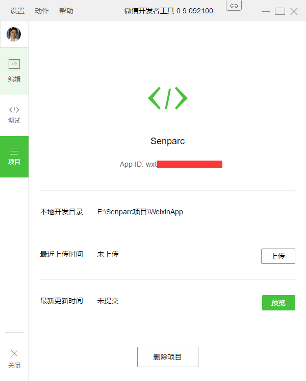

微信小程序开发资源
=================

服务器端SDK
----------
[Senparc.Weixin.MP.dll](https://github.com/JeffreySu/WeiXinMPSDK) + [Senparc.Weixin.WxOpen.dll](https://github.com/JeffreySu/WxOpen) 
完美支持微信小程序开发！

QQ群
--------
Senparc.Weixin 12群：108830388

微信官方WIKI
--------

https://mp.weixin.qq.com/wiki?t=resource/res_main&id=mp1474632113_xQVCl&token=&lang=zh_CN

1. [小程序开发文档](https://mp.weixin.qq.com/debug/wxadoc/dev/index.html)
2. [小程序设计指南](https://mp.weixin.qq.com/debug/wxadoc/design/index.html)
3. [小程序开发工具](https://mp.weixin.qq.com/debug/wxadoc/dev/devtools/download.html)

    直接下载（`此程序为微信官方提供，不需要进行破解、运行0.7版本等繁琐步骤。`）：
    
    [windows 64](https://servicewechat.com/wxa-dev-logic/download_redirect?type=x64&from=mpwiki&t=1474644089434)

    [windows 32](https://servicewechat.com/wxa-dev-logic/download_redirect?type=ia32&from=mpwiki&t=1474644089434)

    [mac](https://servicewechat.com/wxa-dev-logic/download_redirect?type=darwin&from=mpwiki&t=1474644089434)

## 如果我想用破解的怎么办？

> 提示：现在新版本小程序开发工具已经可以提供测试账号，如果没有 AppId 也没有关系，已经无需破解，以下方法为旧版本的破解方法，仅供参考。

破解的用处在于你可以不受“无AppID”带来的功能限制。

1. 选择上述Windows或Mac版本进行安装（0.9），
如果没有安装0.7的请先安装0.7（[Windows](http://dldir1.qq.com/WechatWebDev/release/0.7.0/wechat_web_devtools_0.7.0_x64.exe) / [Mac] (http://dldir1.qq.com/WechatWebDev/release/0.7.0/wechat_web_devtools_0.7.0.dmg)）

2. [[下载](https://github.com/JeffreySu/WeiXinMPSDK/archive/master.zip)]
本库源文件，在当前目录的`crack`文件夹下选择`win`或`mac`对应目录，覆盖安装0.9版本目录下同名文件夹（package.nw或Resources）

3. 启动0.7版本程序，扫描登陆，关闭（不是卸载）

4. 启动0.9版本程序

5. 完成

### 界面界面截图

### Demo下载

http://pan.baidu.com/s/1o8hJGeQ 密码：wlc4

### 说明

所有软件及信息均来自网络，仅供学习之用。
